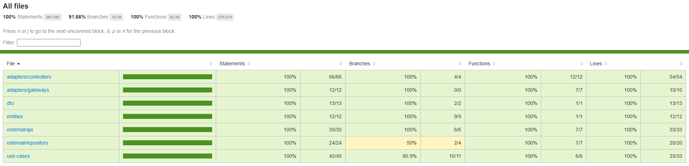
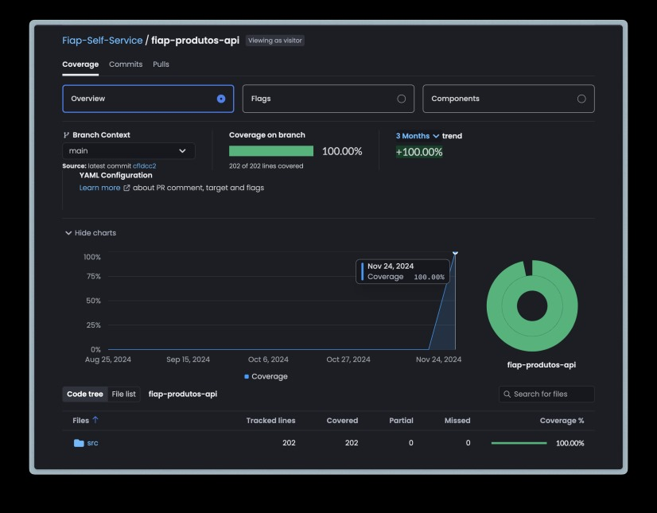

# Entrega Tech Challenge

### **Grupo 37**

**Integrantes**

Lucas Leal - **RM355575** - [leallucasfonseca@gmail.com](mailto:leallucasfonseca@gmail.com)

Merhy Omar Daychoum - **RM356180** - [merhydaychoum@gmail.com](mailto:merhydaychoum@gmail.com)

Wanderson Pereira - **RM356410** - [wanderson.p.ayres@gmail.com](mailto:wanderson.p.ayres@gmail.com)

Jackson Carbonera - **RM354963** - [jwccarbonera@outlook.com](mailto:jwccarbonera@outlook.com)

**Funcionalidades:**

- **Gerenciamento das Intenções de Pagamento:**
  - Criação e gerenciamento de intenções de pagamento.
  - Integração com gateways externos de pagamento.

## **Entregáveis**

### **_Tech Challenge 4_**

**Repositórios**
  - Fiap-Pedidos-Api: https://github.com/Fiap-Self-Service/fiap-pedidos-api
  - Fiap-Pagamentos-Api: https://github.com/Fiap-Self-Service/fiap-pagamentos-api
  - Fiap-Clientes-Api: https://github.com/Fiap-Self-Service/fiap-clientes-api
  - Fiap-Produtos-Api: https://github.com/Fiap-Self-Service/fiap-produtos-api

**Repositórios Infra**
  - Banco de Dados com Terraform: https://github.com/Fiap-Self-Service/fiap-self-service-database
  - Infra Kubernetes com Terraform: https://github.com/Fiap-Self-Service/fiap-self-service-k8s

**Cobertura de testes**

**Cobertura de testes**

||
|:-:|
| *Imagem 1. Cobertura de testes unitários* |

||
|:-:|
| *Imagem 2. Plataforma codecov integrada ao CI/CD.* |